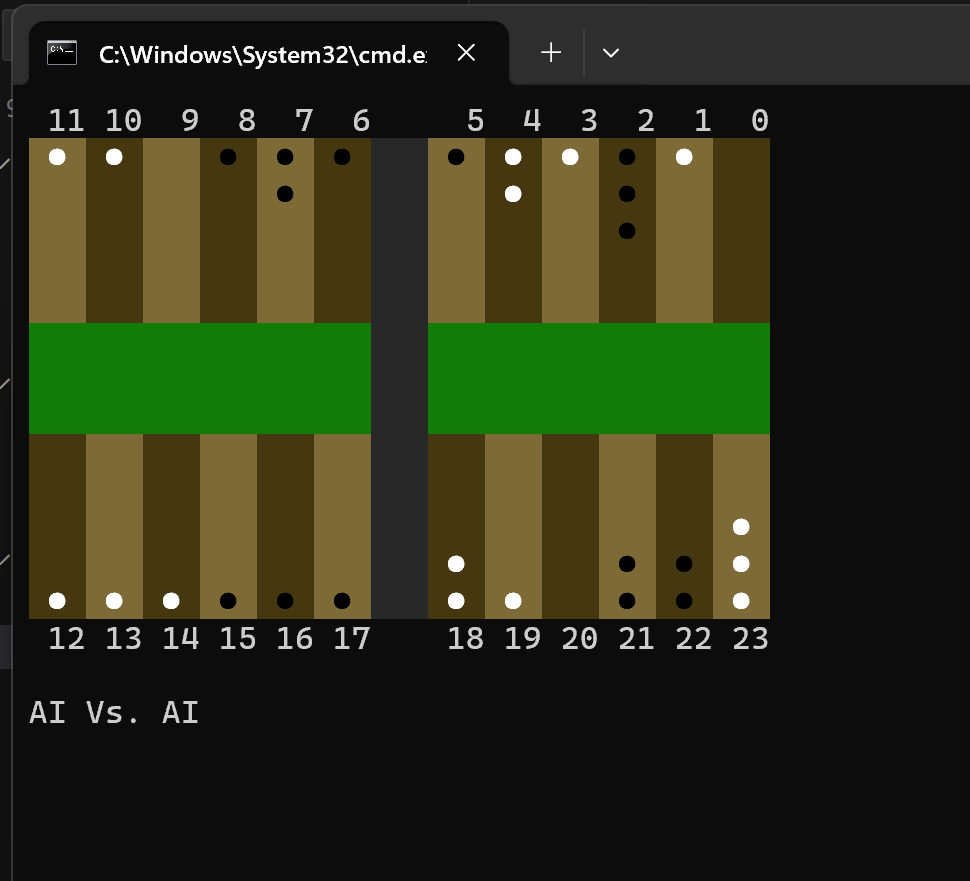
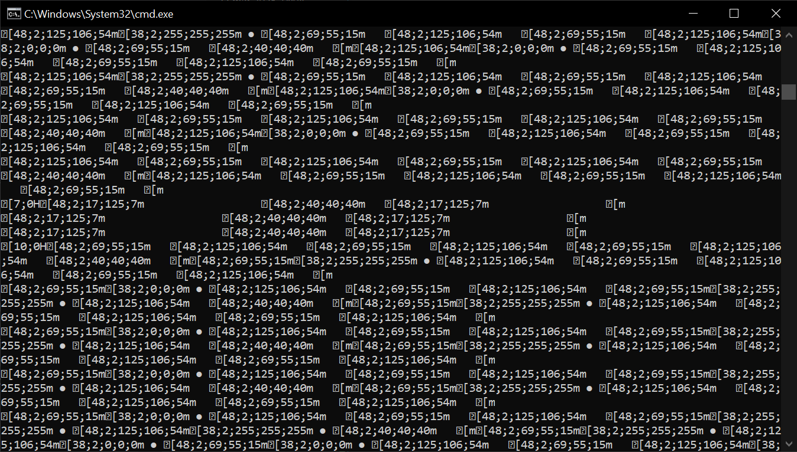

# 02180-Backgammon

## README Notes:
Please note that this installation guide has been generated by ChatGPT, but tested with a Windows installation, compilation, and execution.

## Prerequisites
To run a Maven project with Java 17, you need to install the following:

- **Java Development Kit (JDK) 17**
- **Apache Maven**
- **Git (optional, for cloning repositories)**

This guide covers the installation and setup for both **Windows** and **Linux**.

---

## Installation Instructions

### Windows

#### 1. Install Java 17
1. Download Java 17 from the [Oracle JDK website](https://www.oracle.com/java/technologies/javase/jdk17-archive-downloads.html) or use an alternative OpenJDK distribution like [Adoptium](https://adoptium.net/).
2. Run the installer and follow the setup instructions.
3. Set up the environment variables:
    - Open **Control Panel > System > Advanced System Settings > Environment Variables**.
    - Under **System Variables**, add or update `JAVA_HOME` to point to the JDK installation directory (e.g., `C:\Program Files\Java\jdk-17`).
    - Add `%JAVA_HOME%\bin` to the `Path` variable.
4. Verify the installation:
   ```sh
   java -version
   javac -version
   ```

#### 2. Install Maven
1. Download the latest Maven binary from [Apache Maven](https://maven.apache.org/download.cgi).
2. Extract the archive to a directory (e.g., `C:\Program Files\Apache\maven`).
3. Configure environment variables:
    - Add `MAVEN_HOME` and set it to the extracted Maven directory.
    - Add `%MAVEN_HOME%\bin` to the `Path` variable.
4. Verify the installation:
   ```sh
   mvn -version
   ```

### Linux (Debian/Ubuntu-based)

#### 1. Install Java 17
```sh
sudo apt update
sudo apt install openjdk-17-jdk -y
```
Set `JAVA_HOME`:
```sh
echo "export JAVA_HOME=$(dirname $(dirname $(readlink -f $(which javac))))" >> ~/.bashrc
source ~/.bashrc
```
Verify installation:
```sh
java -version
javac -version
```

#### 2. Install Maven
```sh
sudo apt install maven -y
```
Verify installation:
```sh
mvn -version
```

For **RHEL/CentOS-based distributions**, use:
```sh
sudo yum install java-17-openjdk-devel -y
sudo yum install maven -y
```

---

## Running a Maven Project

### Build the Project
```sh
mvn clean install
```

### Run the Application

Find the built JAR file (usually in `target/`) and run:
```sh
java -jar target/02180-Backgammon-1.0-SNAPSHOT.jar
```

---

## Troubleshooting

### "Java not found" or "Invalid version"
- Ensure Java 17 is installed and `JAVA_HOME` is correctly set.
- Restart your terminal or command prompt after making changes.

### "mvn command not found"
- Ensure Maven is installed and added to the system `Path`.
- Try running `source ~/.bashrc` (Linux) or reopening the command prompt (Windows).


## Using the application

The backgammon game needs two types of player to start the game.
There are three choices for players: Human / Expectiminimax / MonteCarlo, where everything except for human, are AI algorithms playing the game.
Please enter any combination of these players exactly how it is written above (although it is case insensitive) to start the game.
<br><br>
Valid move formats for human are as following:
- Normal move: (FROM TO), ex white moving from 1 to 5: (1 5)
- Reentry move: (B TO), ex black reentry to 22: (B 22)
- Bearing out move: (FROM W ROLL), ex white bearing out from 21 using dice 5: (21 W 5)

### Garbled output
Please refer to image below, to see how the game should look. If your game does not look like this when executing, it is either because your terminal does not support ANSI 256 colors, or UTF-8 output. Please use a newer terminal for executing to avoid these issues.<br>

Linux machines usually do not have these problems, and on Windows, it can usually be fixed by writing the following command before executing the program:

For CMD:
```sh
chcp 65001
```
For PowerShell:
```pwsh
[Console]::InputEncoding = [Console]::OutputEncoding = [System.Text.UTF8Encoding]::new()
```



Below is a picture of what the game should NOT look like, and it is recommended to use a newer terminal.

